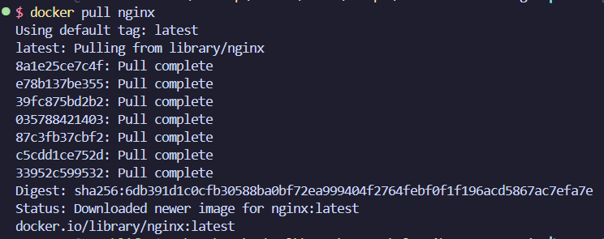

# Devops

BLONDY Matis

## DockerCLI

pull nginx image

run the image with the given path

## Dockerfile

making DOCKERFILE

running DOCKERFILE

checking if the image was created

running the container

checking that the server works

## Docker compose
